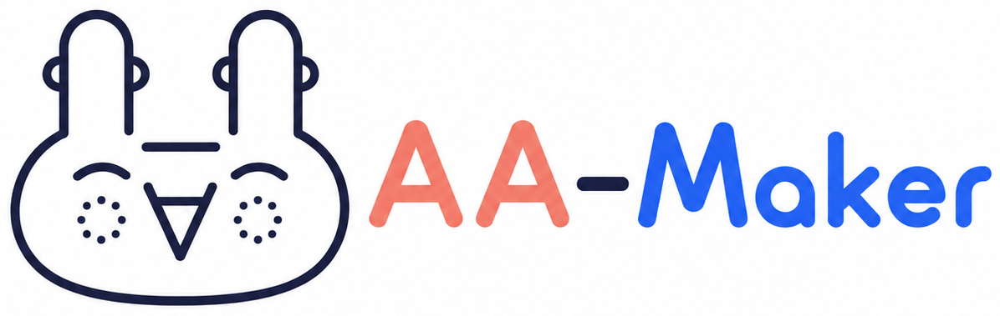
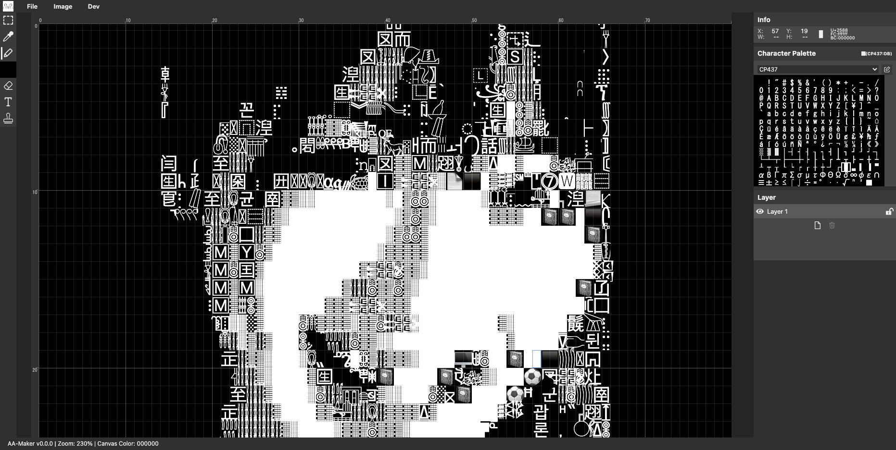
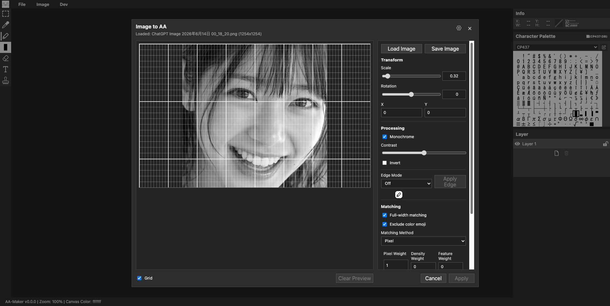

# AA Maker

<p align="center">
  
</p>

<p align="center">
  
  
  
  
  
  
  
  
</p>

AA Maker は、ブラウザ上で初期80x25の可変グリッドに文字を配置してアスキーアートを編集するアプリです。

半角・全角の表示幅を考慮した編集、レイヤー、文字色/背景色、パレット、スタンプ、保存/読み込み/エクスポート、画像から AA 生成を扱います。

## アプリ全景



## 特筆すべき機能

- Unicode の全ての文字を使って創作できる
- Unicode の全文字ビューアとして使える
- 文字や画像を Unicode の全文字から検索できる
- 画像から AA を生成する `Image to AA` を使える

## Image to AA



画像を読み込み、加工して、文字マッチングで 80x25 の AA に変換します。

### Edge 化メソッド

- `Sobel`
- `Laplacian`
- `Canny-like` ← オススメ

### 文字マッチングメソッド

- `Pixel`
- `Pixelmatch`
- `Chamfer` ← オススメ
- `Edge Correlation`
- `Template Matching`
- `Contour Shape`

## できること

- 初期80x25、最大256x256の可変グリッド編集
- 半角 / 全角の幅判定を考慮した文字配置
- レイヤー編集
- ペン、消しゴム、テキスト、スポイト、スタンプ
- 文字色 / 背景色の変更
- 保存、読み込み、ライブラリ操作、エクスポート
- `Image to AA` で画像から AA 生成

## 起動方法

リポジトリルートから実行します。

```sh
pnpm install
pnpm dev:aa-maker
```

開発サーバーは `http://127.0.0.1:5174` で固定起動します。ポート使用中は別ポートへ切り替えず起動エラーになります。

よく使うコマンド:

```sh
pnpm build:aa-maker
pnpm preview:aa-maker
```

## 画面構成

- 上部メニュー: `File` / `Image` / `Dev`
- 左側ツールボックス: 選択、スポイト、ペン、消しゴム、テキスト、スタンプ
- 中央編集領域: 初期80x25の可変編集グリッド
- 右側サイドバー: 情報、キャラパレット、レイヤーなど
- `Image to AA` モーダル: 画像ロード、加工、マッチング、適用

## 注意事項

- 固定幅フォント前提のため、`2 / 4ちゃんねる` で見かける AA の見え方をそのまま再現する用途には向きません。
- Unicode の見え方はフォントやブラウザの描画差に影響されます。

## 参照ドキュメント

- [仕様書](./docs/spec.md)
- [データモデル](./docs/data-model.md)
- [画像からAA生成 仕様書](./docs/image-to-ascii-art.md)
